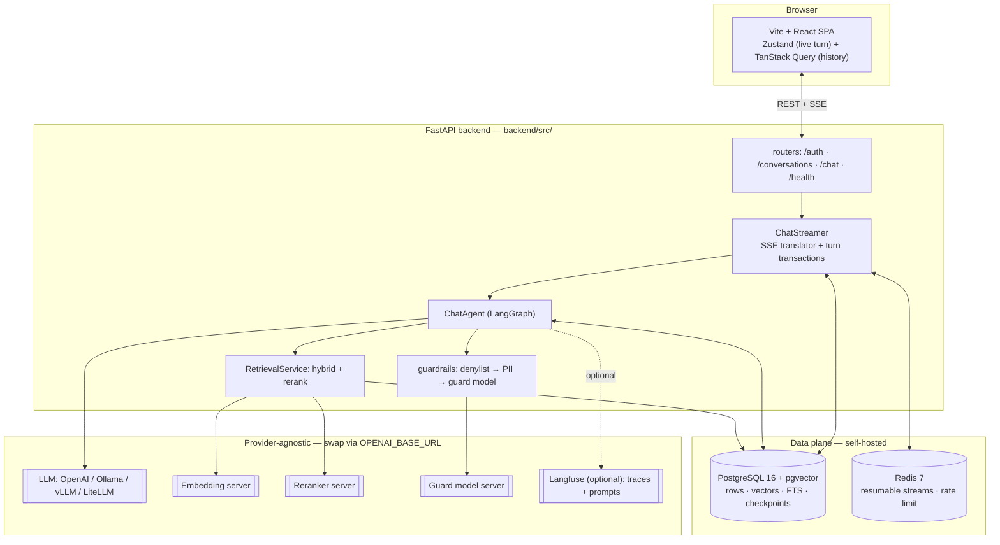
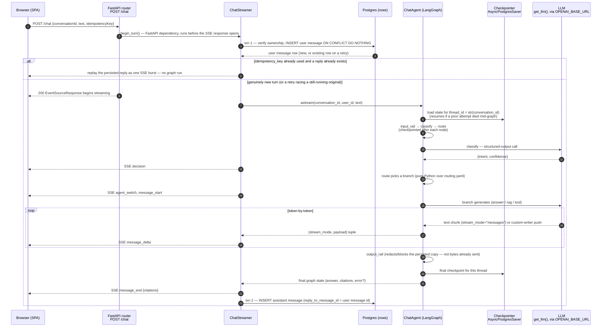
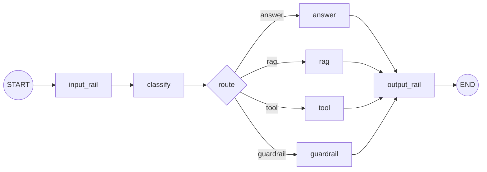
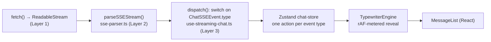

# Cairn Architecture

This document explains how the system in this repository actually works today, as an onboarding
reference for an engineer who just cloned it. For the design rationale, the license-audit trail, and
the phase-by-phase build order that produced this codebase, see [`BLUEPRINT.md`](../BLUEPRINT.md) — that
document is a decision log written across three revisions; this one describes the running system it
produced, verified against the current source in `backend/src/` and `frontend/src/`.

Every claim below was checked against the code, not transcribed from the blueprint's framing. Where the
two disagree — because the blueprint is aspirational in a corner the build hasn't caught up to yet, or
because something was refined after the blueprint was last edited — this document says so explicitly and
describes the as-built behavior.

## Contents

- [What Cairn is](#what-cairn-is)
- [System overview](#system-overview)
- [Backend layering](#backend-layering)
- [One full chat turn](#one-full-chat-turn)
- [The LangGraph agent](#the-langgraph-agent)
- [RAG pipeline](#rag-pipeline)
- [Auth](#auth)
- [Guardrails](#guardrails)
- [The SSE contract and the frontend pipeline](#the-sse-contract-and-the-frontend-pipeline)
- [Multi-client reuse](#multi-client-reuse)
- [Where to look](#where-to-look)

## What Cairn is

Cairn is a self-hostable template for building streaming LLM/agent chat applications: FastAPI +
LangGraph on the backend, Vite + React on the frontend, PostgreSQL + pgvector as the one datastore for
rows, vectors, and full-text search. It's meant to be forked — either copied per client or run as one
neutral reference deployment — not run as a product itself.

A few decisions run through the whole codebase and are worth understanding before anything else:

- **Durable by default, at the step level.** The chat graph is compiled with a Postgres-backed
  checkpointer (`langgraph.checkpoint.postgres.aio.AsyncPostgresSaver`), and every graph run passes
  `durability="sync"`. LangGraph writes a checkpoint after each node ("superstep") completes, *before*
  the next node starts. A crash mid-turn resumes from the last completed node the next time the same
  `thread_id` runs — not from the start of the turn. See [Durability contract](#durability-contract).
- **Contract-first streaming.** The SSE event shapes are defined once as Pydantic models
  (`backend/src/modules/chat/sse.py`), registered into the OpenAPI schema, and compiled into a TypeScript
  discriminated union the frontend imports (`frontend/src/shared/types/sse-events.ts`, generated by
  `make contract`). The LangGraph agent itself never touches SSE — one translator
  (`modules/chat/chat_stream.py::_EventTranslator`) is the only place a graph event becomes a wire event.
- **Provider-agnostic LLM.** Every node gets its model from one function, `agents/llm.py::get_llm(role)`,
  which builds a `ChatOpenAI` pointed at `OPENAI_BASE_URL`. Blank means OpenAI's own API; pointing it at
  a self-hosted LiteLLM proxy, Ollama, or vLLM is a config change, not a code change.
- **Offline-first.** Every external dependency has a no-op or local-fixture default: retrieval defaults
  to a zero-dependency in-memory fixture (`.env.example` ships `USE_LOCAL_RETRIEVAL=true`, though the
  bare `Settings` class default in `core/config.py` is `False` if no `.env` is present at all),
  guardrails are a pass-through unless `GUARDRAILS_ENABLED=true`, durable streaming needs `REDIS_URL` and
  otherwise silently runs in-request, and Langfuse tracing is off unless enabled. The whole stack boots
  and the unit test suite runs with zero external credentials.
- **Neutral core, domain in `examples/`** — this one is honestly a work in progress. `backend/src/core/`
  and `backend/src/modules/` are domain-neutral (`users` / `conversations` / `messages` / `documents`).
  But `backend/src/examples/` is currently just a `.gitkeep` — the shipped "docs-assistant" reference
  example (assistant name, system/answer/classify prompts, the `product_question`/`greeting`/
  `web_search` intent set) still lives partly on core paths: hardcoded defaults in
  `agents/chat/nodes/{answer,rag}.py` (`assistant_name="Cairn Docs Bot"`) and prompt files at
  `backend/config/prompts/docs_assistant/`. `NEW_CLIENT_CHECKLIST.md` documents this plainly rather than
  pretending it's already extracted. If you're building a second domain pack, the pattern to follow is
  the strippable-pack one described in the blueprint, not what's literally there for docs-assistant yet.
- **Self-hosted everything.** No managed database, search service, or cloud config provider. Runtime
  control is a Postgres table plus `watchfiles`-watched YAML/Jinja files plus (optionally) a self-hosted
  Langfuse instance — see [Config tiers](#config-tiers-quick-reference) below.

## System overview



Everything in the `Ext` box is optional and self-hostable — nothing there is a hard dependency the app
needs at boot. Postgres is the one thing that's actually required: it holds the relational data, the
`pgvector` columns, the full-text-search index, *and* the LangGraph checkpoint tables (a separate
`psycopg` connection pool from the app's own `asyncpg`/SQLAlchemy engine — see
[Durability contract](#durability-contract)).

## Backend layering

```
backend/src/
├── core/       infra, no business logic — config, db, DI, security, guardrails, limits, sse framing, stream resume
├── modules/    vertical slices — router → service/streamer → repository → schemas, one dir per concern
├── agents/     the LangGraph runtime — transport-agnostic, emits no SSE, no HTTP awareness
└── examples/   strippable domain packs (currently empty — see the caveat above)
```

Dependencies flow one way: `agents/` and `modules/` may import from `core/`; `core/` never imports from
either (the one sanctioned exception is `core/di/container.py`, the composition root, whose entire job is
wiring the two together). This is enforced by convention and code review, not a lint rule — the code
comments call this out at nearly every import boundary.

Two wiring styles coexist deliberately, split by concern rather than mixed within one:

- **`dependency-injector`** (`core/di/container.py`) wires the **singleton graph and its collaborators
  only** — `chat_agent`, `retrieval_service`, `checkpointer`, `prompt_engine`, `chat_streamer`. The
  justification is concrete: the same graph also has to run outside FastAPI, in a CLI eval harness
  (`backend/tests/eval/`), so it can't be built as a FastAPI `Depends` chain alone.
- **Plain FastAPI `Depends`** wires everything else — `conversations`, `auth`, `chat`'s per-request turn
  validation. `modules/chat/router.py` resolves exactly one thing from the DI container
  (`di_container.chat_streamer()`); everything else in that router is ordinary `Depends`.

A plain REST request (e.g. `GET /conversations`) is the simple case: router → `Depends`-injected service
→ repository → one committed transaction via `core/db/engine.py::get_session` (commit-per-request,
rollback on exception). The chat endpoint is the one place this gets more involved, because a streaming
response can't hold a request-scoped session open for the whole turn — see the next section.

## One full chat turn



Two transaction boundaries, both explicit and short-lived (`modules/chat/chat_stream.py`), and *never*
held open across the LLM call:

1. **`begin_turn`** — runs as a FastAPI dependency (`_start_chat_turn` in `modules/chat/router.py`),
   before the streaming response begins. That placement matters: a bad `conversation_id` needs to come
   back as a clean `404`, and once `EventSourceResponse` has started streaming bytes, raising from inside
   the generator no longer produces an HTTP error status — it becomes a broken connection instead. The
   same reasoning is why `@chat_rate_limit` decorates this dependency, not the streaming endpoint itself.
2. **`_persist_reply`** — runs after the graph has fully finished, inserting the assistant's message. If
   this fails, the client already has the complete reply over SSE; the failure is logged as a durability
   problem to alert on, not surfaced as a stream error after `message_end` already went out.

### Concurrent retries and idempotency

This is one of the areas where the running code is more refined than the blueprint's original
description ("idempotency key, `INSERT ... ON CONFLICT DO NOTHING`"). The actual behavior in
`ChatStreamer.begin_turn` handles three distinct cases for a `POST /chat` carrying the same
`idempotency_key`:

- **First attempt.** The insert succeeds (`created=True`); the turn claims an in-flight marker
  (`asyncio.Event`, keyed by `(conversation_id, idempotency_key)`) and runs the graph normally.
- **A retry after the original finished.** The insert conflicts; `MessageRepository.get_reply_to` finds
  the persisted assistant reply by `reply_to_message_id` (not a "most recent message in the
  conversation" heuristic, which the code notes was unsound) and replays it as one SSE burst — no second
  graph run, no second LLM call.
- **A retry while the original is still generating** — the common case when a client re-POSTs because
  an SSE response looked hung. The insert conflicts, but there's no reply yet. The retry waits on the
  in-flight `asyncio.Event`, bounded by `TURN_BUDGET_SECONDS`, then re-checks for a persisted reply.

That in-flight marker is explicitly **process-local** (a module-level dict, not Redis-backed) — a retry
landing on a different replica in a multi-process deployment finds no local marker and falls through to
re-running the graph. The code documents this as a known, accepted gap: closing it needs a distributed
lock (Postgres advisory lock or Redis), which is out of scope for what a single-backend-instance retry
actually needs.

## The LangGraph agent

### Node graph



The edge set is fixed (`agents/chat/graph.py`) — there is no dynamic rewiring. Every node runs exactly
once per turn except the worker nodes, which the conditional edge out of `route` sends to exactly one of.
What each node does:

| Node | What it does |
|---|---|
| `input_rail` | No-op unless `GUARDRAILS_ENABLED`. Runs the denylist → PII → guard-model pipeline over the user's raw input. A block clears `state["input"]` and sets `state["error"]="input_rail_blocked"` — it can't jump straight to `guardrail` (edges are fixed), so `classify` still runs once on an emptied input; `route` checks for that error code *before* its normal routing-table lookup and redirects to `guardrail` regardless of what `classify` produced. |
| `classify` | One structured-output call (`with_structured_output`, method from `STRUCTURED_OUTPUT_MODE` — `json_schema` by default) producing `{intent, confidence}`. Any failure — timeout, provider error, malformed output — degrades to `{intent: "unclear", confidence: 0.0}` rather than failing the turn. |
| `route` | Pure Python, no LLM call. Looks `intent` up in `config/behavior/routing.yaml` (hot-reloaded, runtime-overridable) and dispatches to that intent's `route`. Below `confidence_threshold` or no match → `default_route`. |
| `answer` | Plain reply, no retrieval, no tools — the `greeting` intent today. |
| `rag` | Hybrid retrieval → abstain-or-ground → cite. See [RAG pipeline](#rag-pipeline). |
| `tool` | A bounded tool-calling loop (`bind_tools`), hop-capped at `MAX_GRAPH_HOPS`. Ships two demo tools (`get_current_date`, a stub `web_search` that explains it isn't configured) — no real external API key is required to boot. |
| `guardrail` | Distinguishes a real block (`input_rail`/`output_rail` set an error code) from a plain low-confidence/`unclear` routing outcome, and replies with a refusal vs. a clarification prompt accordingly. `interrupt()`-based human-in-the-loop review is not wired here — there's no reviewer queue yet — but the node's shape already supports adding it later without a graph rewire. |
| `output_rail` | The mirror of `input_rail`, run over `state["answer"]` after every branch converges. No-op unless `GUARDRAILS_ENABLED`. |

Every worker/router node's failure path degrades to a graceful, user-facing message rather than raising
an unhandled exception out of the graph — the fallback ladder is implemented per-node
(`try/except` around the LLM call, `agents/chat/nodes/*.py`), not centrally.

### Durability contract

The checkpointer is `langgraph.checkpoint.postgres.aio.AsyncPostgresSaver`
(`core/db/checkpointer.py`), given its own `psycopg` (v3) connection pool — separate from the app's
`asyncpg`-backed SQLAlchemy engine, because it's a different driver against the same database. The pool
is built with `open=False` (constructing it never touches the network); `main.py`'s lifespan is the one
place that `await`s `.open()` and calls `AsyncPostgresSaver.setup()` — idempotent, creates the checkpoint
tables on first run — once at app startup. This deliberately does **not** go through Alembic, so it can
never race or duplicate the app's own migrations.

`thread_id` is `str(conversation_id)` — a UUID string, chosen because the checkpointer's `thread_id`
column is bounded, not because it's semantically a "thread." Calling `ChatAgent.astream`/`ainvoke` again
with the same `conversation_id` resumes that thread's graph state instead of starting fresh, which is
what makes a crash mid-graph recoverable.

What actually happens on a crash: LangGraph writes a checkpoint after each node completes. `ChatAgent`
(`agents/chat/agent.py`) passes `durability="sync"` on every `astream`/`ainvoke` call *when a checkpointer
is configured* — the checkpoint for a node is written *before* the next node runs, trading a little
latency for the guarantee that a completed step is never silently lost. (`checkpointer=None` is a real,
supported configuration — the CLI eval harness and some unit tests run the graph with no persistence at
all; `ChatAgent` computes once at construction time whether `durability="sync"` is even safe to pass,
because passing it with no checkpointer hits a LangGraph code path that assumes one exists.) If the
process dies between `route` and `rag` finishing, the next invocation with the same `thread_id` resumes
*after* `route` — not from the start of the turn.

Three distinct mechanisms are easy to conflate here, and the code keeps them genuinely separate:

- **`durability="sync"`** — survives a process crash or pod kill, across requests, via the checkpointer.
- **`RetryPolicy(max_attempts=3)`**, attached to the LLM/tool-calling nodes (`classify`, `answer`, `rag`,
  `tool`) — survives a transient failure *within the same run* (a timeout, a flaky provider response, a
  structured-output parse failure). This is on top of `get_llm()`'s own `max_retries=3` client-side retry
  for a single HTTP call; the node-level policy covers the whole node, including failures after a
  successful call.
- **Per-node `timeout=`** on `graph.add_node(...)` — a graph-level backstop *above* each node's own
  per-role timeout (`agents/config.py`'s `RoleConfig.timeout`, enforced by `ChatOpenAI(timeout=...)`).
  The node's own fallback ladder is expected to catch its role timeout first; this only fires if that
  somehow doesn't happen. `TURN_BUDGET_SECONDS` (default 90s) separately wraps the *entire* graph run via
  `asyncio.timeout` in `ChatAgent.astream`/`ainvoke`, applied by the caller, not the graph structure.

**Idempotency on node re-execution** is a real, documented constraint, not just a checkpointer guarantee:
if a process crashes *after* a node's side effect lands but *before* its checkpoint write completes, a
resume re-executes that entire node — LangGraph checkpoints per node, not per side effect within one. The
`tool` node's two bundled demo tools are naturally idempotent (pure functions of their arguments); a real
tool with an external side effect (a third-party API write) would need its own idempotency key threaded
through the call, because "the checkpointer already ran this" is exactly false in that crash window.

### Streaming technique

The graph is driven with `graph.astream(..., stream_mode=["updates", "messages", "custom"])` — one call,
three multiplexed channels that `_EventTranslator` (`modules/chat/chat_stream.py`) reads together:

- **`"updates"`** — each node's partial state update as it completes. Drives `decision` (from
  `classify`), `agent_switch`/`message_start` (from `route`), and `message_end`/`guardrail`/`error` (from
  whichever branch node just finished).
- **`"messages"`** — LangGraph's auto-streamed token-by-token model output, for any node's plain
  (non-tool-bound, non-structured-output) LLM call. This covers `answer` and `tool`'s final non-tool-call
  turn.
- **`"custom"`** — text a node explicitly pushes via `get_stream_writer()`. `rag` uses this: its answer
  is only meaningful once retrieval, abstention, and citation numbering have all landed together, so it
  can't rely on `stream_mode="messages"` the way `answer` does — it streams incrementally through the
  custom writer instead, and the translator suppresses `rag`'s raw model events to avoid double-emitting.
  `tool` also pushes one `tool_result` custom event per completed tool call, so the client can show "ran
  `get_current_date`" as it happens rather than only after the whole bounded loop finishes.

The reason a structured/forced-tool node can't just use `on_chat_model_stream`: those events carry only
tool-call argument deltas, not user-facing text. `classify` and the tool-selection turns inside `tool`
are exactly that case, which is why neither streams token-by-token — there's no user-facing text to
stream from them.

## RAG pipeline

Behind one `Protocol` (`modules/retrieval/protocol.py`), three interchangeable implementations, built by
`modules/retrieval/factory.py::build_retrieval_service`:

- **`LocalFixtureRetrievalService`** — zero-dependency, in-memory fixture. What `USE_LOCAL_RETRIEVAL=true`
  (the shipped `.env.example` default) actually runs.
- **`PgVectorHybridRetrievalService`** — the real pipeline.
- **`RerankedRetrieval`** — wraps either of the above with a cross-encoder rerank pass.

**Hybrid retrieval** (`modules/retrieval/pgvector.py`): two overfetched candidate lists — vector search
(HNSW, `ORDER BY embedding <=> query_embedding`) and lexical search (`plainto_tsquery`/`ts_rank` against
a generated `tsvector` column) — each overfetching `top_k × 4` rows, fused with **Reciprocal Rank
Fusion** (`k=60`, the standard smoothing constant from the original RRF paper). This is a genuine
production step up from plain cosine similarity: a query that's strong lexically (an exact identifier)
but weak semantically, or vice versa, still surfaces. Postgres `tsvector`/`ts_rank` is an approximation
of BM25 — no IDF weighting, no document-length normalization — not the real thing; it's the
zero-extra-dependency default, with `pg_search`/`pg_textsearch` named as the swap-in for corpora where
that gap actually matters. Filtered queries (a `document_id` filter) set
`hnsw.iterative_scan = 'relaxed_order'` per-transaction (`SET LOCAL`) to avoid the recall collapse a naive
post-filter causes on an HNSW index.

**Reranking** (`modules/retrieval/reranker.py`): overfetch the hybrid result, score every candidate with
a self-hosted cross-encoder over HTTP (`bge-reranker-v2-m3` by default, a TEI/vLLM-style `POST
/rerank` endpoint), take the top-k, dedupe by `parent_id` (so multiple chunks from the same source
section don't crowd out other results). Degrades gracefully in both directions: no `RERANKER_BASE_URL`
configured, or a reachable-but-erroring reranker at request time, both fall back to the unreranked fused
candidates rather than failing the turn — logged once, not on every query.

**Abstention** (`agents/chat/nodes/rag.py`) is calibrated against *which kind* of score the retrieved
docs actually carry, not a single bare threshold — this is a subtlety worth being precise about, because
getting it wrong abstains on every query:

- If the docs were reranked (`score_is_calibrated=True`), the score is a cross-encoder relevance score in
  roughly `[0, 1]`; the default abstain threshold is `0.15`.
- If they weren't (no reranker configured, or it failed and fell back), the score is an RRF rank-fusion
  artifact that tops out around `2/61 ≈ 0.033` with the default `k=60` — comparing *that* against a
  threshold calibrated for a reranker score would abstain on essentially everything. The unreranked
  threshold defaults to `0.0`, which only catches a genuinely empty candidate set.

Below threshold: an abstention message if there were candidates at all, a different "no documentation
covering that" deferral if retrieval returned nothing. Both are treated as `abstained=True`, and RAG
grounds its answer in numbered citations from the retrieved passages via
`config/prompts/docs_assistant/answer.j2` — treating retrieved text as **context to cite, never as
instructions to follow** (the indirect-injection angle of OWASP's prompt-injection category: retrieved
documents are untrusted input the same way user input is).

**Ingestion** (`modules/ingestion/pipeline.py`, run via `make ingest` against
`backend/data/sample_corpus/`): split each document into `##`-heading sections, chunk each section
(`RecursiveCharacterTextSplitter`-style, via `chunking.py`), embed in batches of 64, upsert. Chunks from
the same section share one `parent_id` — what reranking's dedupe step uses. Re-ingesting the same source
path is idempotent: it replaces that document's chunks wholesale rather than appending duplicates.
`Chunk.embedding_version` is stamped per-chunk so a future embedding-model migration can find and
re-embed only stale rows.

**Embeddings** default to a self-hosted, Apache-2.0 model (`EMBEDDING_MODEL=Qwen3-Embedding-0.6B`,
`EMBEDDING_DIMENSION=1024`), reached the same way the LLM is — an OpenAI-compatible endpoint via
`OPENAI_BASE_URL`. A hosted API (`text-embedding-3-small`) is a documented opt-in, not the default.

## Auth

`fastapi-users` (MIT) plus a JWT bearer scheme, with two things worth being precise about because they
diverge slightly from what a stock `fastapi-users` integration looks like:

**Two different places verify the same token, deliberately.** `modules/auth/users.py` wires up
`fastapi-users`' own machinery (`current_active_user`, used only by `GET /auth/me` — a DB round-trip to
check `is_active`, fine for a single "who am I" call). Every ownership-scoped router
(`conversations`, `chat`) instead depends on `core/security/current_user.py::get_current_user_id`, which
verifies the JWT **independently** with `PyJWT` against `settings.JWT_SECRET` — it does not call into
`modules/auth/`. The reason is layering: `core/` must not import from `modules/`, and going through
`fastapi-users`' dependency from a `core/` module would violate that. Both must sign/verify the same
audience claim (`"fastapi-users:auth"`, `fastapi-users`' own default) — the two files each carry a
comment pointing at the other so they don't drift.

That means `get_current_user_id` does **not** re-check `is_active`/deletion against the database on every
request the way `current_active_user` does — a deactivated user's still-valid access token keeps working
until it naturally expires (`ACCESS_TOKEN_LIFETIME_SECONDS`, one hour by default). The revocable
refresh-token layer (`modules/auth/refresh_tokens.py`, its own `refresh_tokens` table) bounds exposure
past that window: a deactivated/logged-out user can't mint a *new* access token, but an already-issued one
isn't retroactively revoked. This is a documented, deliberate tradeoff, not an oversight — the same
codebase elsewhere states plainly that "the structlog censor is logs-only and is not data protection," and
this is the same "state the tradeoff loudly" posture applied to auth.

**Login/refresh/logout are hand-rolled**, not `fastapi-users`' bundled login router — because stock
`fastapi-users` JWT auth has no refresh-token concept and its logout is a no-op for a stateless strategy.
`POST /auth/login` and `/auth/refresh` return an access+refresh `TokenPair`; `/auth/logout` revokes the
presented refresh token. `POST /auth/register` is still `fastapi-users`' own bundled router — it needed
no changes.

**Ownership is enforced at the repository layer, not just the router.** Every conversations/messages
query takes `user_id` as a real `WHERE` clause parameter (`ConversationRepository.get_owned`,
`MessageRepository.get_owned`, both in `modules/conversations/repository.py`) — a caller can't accidentally
skip the scoping the way they could if it only happened as a router-level check. A conversation that
exists but belongs to someone else returns a plain `404`, not a `403` — deliberately, so the API can't be
used to enumerate which IDs exist. The same pattern extends to durable-mode SSE streams: `stream_id`
ownership is recorded in Redis before the response carrying it is returned, and `resume`/`stop` both
check it the same "404, don't distinguish 'not yours' from 'doesn't exist'" way.

`AUTH_ENABLED=true` is the default; conversations are per-user, not an optional feature.
`AUTH_ENABLED=false` gives every request a fixed `ANONYMOUS_USER_ID` and is meant only for eval/CI runs
that don't need real identity — the codebase is explicit that this isn't the reference default for a real
deployment. The branch between the two `get_current_user_id` implementations is decided once, at import
time, from the static `Settings` value — not re-checked per request.

## Guardrails

`GUARDRAILS_ENABLED=false` by default — a true no-op that never imports Presidio or reaches a guard-model
endpoint. This is a chat-graph-adjacent module (`core/guardrails/`), invoked by the `input_rail`/
`output_rail` nodes on either side of the graph, not a separately-running service.

When enabled, both rails run the same three layers in order, stopping at the first block:

1. **Deterministic denylist/delimiter check** (`core/guardrails/patterns.py`) — zero dependencies,
   patterns and delimiter markers in `config/behavior/guardrails.yaml`, hot-reloaded and
   runtime-overridable like every other behavior file.
2. **PII redaction** (`core/guardrails/pii.py`, Presidio) — runs on whatever survives step 1. Presidio is
   an *optional* dependency group (`uv sync --group guardrails`), not installed by default — consistent
   with offline-first boot. Missing the package degrades to a loud no-op (logged at error level, text
   passed through unchanged), not a crash.
3. **Guard-model classification** (`core/guardrails/granite_guardian.py`) — only runs if
   `GUARDIAN_MODEL_BASE_URL` is set; blank skips this layer the same way `RERANKER_BASE_URL` blank skips
   reranking. Called directly as a chat completion against a self-hosted, OpenAI-compatible endpoint
   (Granite Guardian's documented usage: the completion is literally the token "Yes" or "No"), not
   through a Colang rules engine.

Worth noting explicitly: **this layer fails closed, unlike the reranker.** A guard-model call that errors
(timeout, unreachable endpoint) returns `blocked=True` — a guardrail that silently stops guarding on its
own failure defeats the point. A deployment that would rather fail open should leave
`GUARDIAN_MODEL_BASE_URL` unset, which skips the layer explicitly, rather than relying on an error path
to do it implicitly.

**The default guard model is Granite Guardian (IBM, Apache-2.0), not Llama Guard**, and this is a license
decision, kept brief here since the full audit lives in the blueprint: Llama Guard ships under Meta's
"Llama Community License," which is not OSI-approved open source — a 700M-monthly-active-users commercial
cap, a binding Acceptable Use Policy, and mandatory attribution on derivatives, all of which would
transitively bind every client fork of this template. Llama Guard is reachable only through
`core/guardrails/llama_guard.py`, gated on its own independent flag
(`GUARDRAILS_LLAMA_GUARD_OPT_IN`) — the default `rails.py` pipeline never imports that module, so turning
on `GUARDRAILS_ENABLED` cannot reach it by accident. **NeMo Guardrails** (Apache-2.0, orchestration only)
is not wired in as the default rails engine either: the guard-model call's signature
(`classify(text, direction) -> RailVerdict`) is deliberately simple enough to register as a NeMo custom
action for a deployment that wants its richer multi-flow orchestration on top, but this template doesn't
ship an unverified Colang flow set and call it "the default."

**Streaming caveat, stated as plainly in the code as here:** by the time `output_rail` runs, the branch
node that produced the answer has already streamed it to the client over SSE — token-by-token or as one
delta at branch completion. `output_rail`'s redaction reaches what gets *persisted* (and therefore what a
later REST fetch, future LLM context, or audit sees), not bytes already on the wire. A stronger
before-the-first-byte guarantee would mean buffering each branch's full output before streaming any of
it, trading away real-time token streaming — redacting PII at the source (prompts, retrieved context) is
the more targeted fix if that gap matters for a deployment.

## The SSE contract and the frontend pipeline

### Wire contract

`modules/chat/sse.py` defines the event set as Pydantic models (snake_case in Python, camelCase on the
wire via a shared `alias_generator`): `message_start`, `message_delta`, `message_end` (carrying
citations), `agent_switch`, `tool_result`, `decision`, `guardrail`, `error`. They're combined into one
discriminated union (`ChatSSEEvent`, `Field(discriminator="type")`) and merged into the app's OpenAPI
schema at startup (`register_sse_schema`, since SSE responses bypass FastAPI's normal `response_model`
mechanism and would otherwise never reach `/openapi.json`). `frontend/scripts/generate-contract.ts` runs
`openapi-typescript` against that schema to produce
`frontend/src/shared/types/sse-events.ts` — the same discriminated union, now in TypeScript, checked into
CI via `make contract-check` for drift.

`SSEEventFormatter` (same file) stamps a monotonic `id:` on every event, which is what makes
`Last-Event-ID`-based resume possible. FastAPI's native `EventSourceResponse` (shipped since FastAPI
≥0.135) handles heartbeats and disconnects; the earlier `sse-starlette` dependency this template used to
carry is gone.

**Two streaming modes**, chosen by `STREAM_DURABLE` + a configured `REDIS_URL`:

- **Simple** (default) — the producer runs in-request; `POST /chat`'s generator yields
  `ServerSentEvent`s straight into `EventSourceResponse`. Dies with the request on a disconnect.
- **Durable** (`STREAM_DURABLE=true`, `REDIS_URL` set) — the producer runs as a decoupled background
  `asyncio.Task`, writing `id:`-stamped frames into a Redis Stream keyed by a server-generated
  `stream_id` (`core/stream/resume.py::RedisStreamBus`). `GET /chat/stream/{stream_id}?last_event_id=...`
  resolves the client's last-seen id to a Redis-native position and tails from there. `POST
  /chat/stream/{stream_id}/stop` is the true-terminate path — an `AbortController` on the client only
  stops that tab's *read*; the server-side producer keeps running and writing frames until `/stop` says
  otherwise (or a same-process `asyncio.Task.cancel()` catches it faster, best-effort).

### Frontend pipeline



- **Layer 1 (fetch)** — POST with `Accept: text/event-stream`, read the response body as a
  `ReadableStream`.
- **Layer 2 (parser, `shared/api/sse-parser.ts`)** — a framework-agnostic async generator: decode →
  buffer → split on blank lines → skip `:`-prefixed comments (including FastAPI's `:ping` heartbeat) →
  `JSON.parse` the accumulated `data:` lines. A malformed payload surfaces as a typed `{kind:
  "parse-error"}` item, not a silent `console.warn` — the caller decides whether one bad frame ends the
  stream. A genuine network failure is *not* caught here; it propagates as a thrown error, which is
  exactly the signal the caller needs to distinguish "bad data" from "connection dropped, try to resume."
- **Layer 3 (dispatch, `features/chat/hooks/use-streaming-chat.ts`)** — switches on the event's
  discriminated `type` and calls one `chat-store` action per case.
- **Typewriter** (`features/chat/lib/typewriter-engine.ts`) — a `requestAnimationFrame`-driven queue
  draining at a target chars/sec, independent of React/Zustand. Latency-bounded (backlog past
  `maxLagChars` grows the per-tick reveal budget so a token burst can't leave the visible text arbitrarily
  behind the network), visibility-aware (a hidden tab flushes everything synchronously rather than
  freezing mid-stream, checked at push-time, tick-time, and via a `visibilitychange` listener since rAF is
  throttled in background tabs), and respects `prefers-reduced-motion` the same way. Tool-result
  "artifacts" are ordered into the same queue as text, so a `tool_result` card only appears once every
  text chunk queued ahead of it has finished revealing — plain FIFO order, no separate bookkeeping.

**Resumability, as actually implemented in `use-streaming-chat.ts`:** a clean end (`message_end` seen, or
the body simply ends right after it) is not a disconnect — no further network activity. A stream that
ends *without* `message_end`, or a `fetch`/read that throws, is treated as one: if the turn has a
`streamId` (durable mode), reconnect to `GET /chat/stream/{id}?last_event_id=...` with capped exponential
backoff (3 attempts). Simple mode has no `streamId` and therefore no resume path — that case surfaces one
clear error event instead of retrying against an endpoint that would just 404.

One subtlety worth flagging because it's easy to get wrong: **an `error` SSE event is not always
terminal.** Verified against a real degraded-LLM run — `rag`/`tool`/`guardrail` node failures emit an
`error` event *and then still finish the turn normally* (a `message_delta` with the graceful fallback
text, then `message_end`); the error is a side-channel diagnostic, not a "stop reading" signal. Only two
cases genuinely end a stream with no `message_end` to follow: the turn-budget timeout, and an unhandled
exception in the streamer's own top-level `except`. The frontend store keeps two separate actions for
this reason — `onGraphError` just records the latest error as informational without finalizing anything;
`onTurnFailed` is what actually folds the turn, and it's only called once the stream itself has ended
without ever reaching `message_end`.

## Multi-client reuse

Cairn is meant to be forked per client, not run multi-tenant, by default — the blueprint's decision rule
(copy-per-client while client count is small and customization goes beyond config/branding; shared
multi-tenancy, with `tenant_id` + Postgres RLS, once that stops being true) is documented in
`BLUEPRINT.md §3.14` and hasn't changed. The mechanics that make copy-per-client actually maintainable
are real, present-day files in this repo:

- **`copier.yml`** — scaffolding config for [Copier](https://copier.readthedocs.io/), not a one-shot
  `git clone`. `copier copy gh:<org>/cairn <client-repo>` writes `.copier-answers.yml` into the new fork,
  which is what lets `copier update` later 3-way-merge upstream template fixes into an already-customized
  client repo instead of hand-porting every bugfix. The prompted variables (`project_name`,
  `client_display_name`, `active_example_pack`, `use_auth`, `use_guardrails`, `use_langfuse`,
  `docker_registry`, ...) flow into `client.config.yaml`.
- **`client.config.yaml`** — the one file (plus `backend/src/examples/<pack>/`) a client fork should ever
  hand-edit. Branding tokens, which example pack is active, LLM provider/model, rate limits, retrieval
  corpus source, feature flags. Keeping divergence in one low-conflict place is what keeps `copier
  update`'s merges clean.
- **`NEW_CLIENT_CHECKLIST.md`** — a working checklist (not aspirational) enumerating everything a real
  client deployment needs before go-live: rename, branding, which example pack, database name, every env
  var/secret that must be regenerated rather than left at its offline-first placeholder
  (`JWT_SECRET` especially — the app fails to boot with the placeholder once `ENVIRONMENT != local`),
  auth/SSO scope, deploy target, and a pre-launch verification pass (including "cross-user ownership
  isolation still holds" as an explicit, non-optional check).

## Where to look

| Concern | Path |
|---|---|
| App assembly, lifespan (checkpointer open/setup, hot-reload watchers, CORS) | `backend/src/main.py` |
| Top-level router mount | `backend/src/routers.py` |
| Static config (tier 1) | `backend/src/core/config.py` |
| Runtime override plane (tier 2, `config_overrides` table) | `backend/src/core/runtime_config.py` |
| Hot-reloaded behavior YAML (tier 3) | `backend/src/core/behavior/loader.py`, `backend/config/behavior/*.yaml` |
| Hot-reloaded prompts (tier 3) + Langfuse overlay | `backend/src/core/prompts/`, `backend/config/prompts/*.j2` |
| SQLAlchemy engine/session, commit-per-request | `backend/src/core/db/engine.py` |
| LangGraph checkpointer pool | `backend/src/core/db/checkpointer.py` |
| DI composition root | `backend/src/core/di/container.py` |
| JWT verification for ownership-scoped routes | `backend/src/core/security/current_user.py` |
| Guardrail rails (denylist, PII, guard models) | `backend/src/core/guardrails/` |
| Rate limit + concurrency cap | `backend/src/core/limits/` |
| Redis-backed durable stream bus | `backend/src/core/stream/resume.py` |
| Generic repository CRUD + keyset pagination | `backend/src/core/repository/base.py` |
| `fastapi-users` wiring, refresh tokens, auth REST | `backend/src/modules/auth/` |
| Conversation/message REST, ownership-scoped repositories | `backend/src/modules/conversations/` |
| Chat router, SSE wire contract, streamer/translator | `backend/src/modules/chat/{router,sse,chat_stream}.py` |
| Retrieval Protocol, pgvector hybrid, reranker, fixture, factory | `backend/src/modules/retrieval/` |
| Embedding client | `backend/src/modules/embedding/service.py` |
| Ingestion pipeline + CLI | `backend/src/modules/ingestion/` |
| Liveness/readiness probes | `backend/src/modules/health/` |
| LLM provider swap-point, per-role model config | `backend/src/agents/llm.py`, `backend/src/agents/config.py` |
| Graph node base class + registry | `backend/src/agents/base.py`, `backend/src/agents/registry.py` |
| The chat graph itself, state shape, one file per node | `backend/src/agents/chat/{graph,state,agent,schemas}.py`, `backend/src/agents/chat/nodes/` |
| Alembic migrations (incl. pgvector/HNSW/tsvector) | `backend/alembic/` |
| Sample ingestible corpus | `backend/data/sample_corpus/` |
| Unit / integration / eval tests | `backend/tests/{unit,integration,eval}/` |
| Router, route guards | `frontend/src/app/{router,ProtectedRoute}.tsx` |
| Chat feature: container, streaming hook, store, typewriter | `frontend/src/features/chat/` |
| Auth feature: login/register, session store | `frontend/src/features/auth/` |
| REST client, SSE parser, generated SSE/API types | `frontend/src/shared/api/`, `frontend/src/shared/types/` |
| shadcn UI primitives (on `@base-ui/react`) | `frontend/src/shared/components/ui/` |
| Per-client divergence manifest | `client.config.yaml` |
| Client scaffolding config | `copier.yml` |
| New-client rollout checklist | `NEW_CLIENT_CHECKLIST.md` |
| Local stack + opt-in add-ons | `docker-compose.yml`, `docker-compose.langfuse.yml`, `docker-compose.litellm.yml` |
| Dev workflow commands | `Makefile` |
| Design rationale, license audit, build order | `BLUEPRINT.md` |
